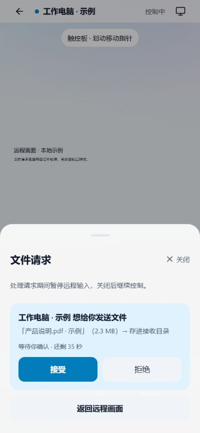
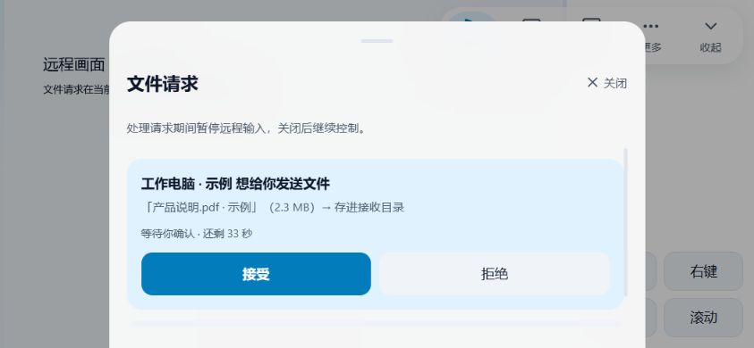

# 手机端交互修复实施记录 · 2026-10-02

基线为当前 C 布局与 B 分层毛玻璃。用户已确认 `design/手机端-交互修复预览-2026-10-02.html`，本次落实交互检查中的 9 类问题，未升级版本、未提交 Git、未打包或安装 APK。

## 已实施

| 检查项 | 结果 |
|---|---|
| 远控时无法处理文件请求 | App 将应用级文件状态传给会话。提醒独立于工具栏；点击打开现有风格的接收面板，不结束会话。接收位置失败可在面板内重试；最后一条请求响应成功后自动返回画面，失败保留面板。 |
| 大文件准备无法取消 | 准备显示文件序号与百分比，可取消整批后续准备。等待当前读取/写入返回后停止，清理当前未提交暂存。最后一块已成功提交则保留文件源与任务，提示在传输记录继续查看或取消。 |
| 加载反馈错位 | 控制、观看、解除配对、接受、拒绝分别显示自己的动作状态。提交解除配对时禁用“保留设备”；连接处理中禁止跳到其他动作。 |
| 横屏恢复视野入口深 | 工具栏直接提供“画面”，打开后可适应屏幕、回到指针、调画质或旋转，不再必须经过“更多”。 |
| 手势指南不匹配默认模式 | 分别说明默认触控板与直接点击，统一工具栏入口和指南描述。 |
| 密码禁用原因不明 | 使用已有统一密码规则显示 6～64 字符要求与错误，提供密码显隐；两种凭证模式都显示目标设备；关闭远程通道、未选目标也有解释。 |
| 配对“收起”含义混用 | 区分“隐藏配对码”和“关闭配对面板”；用“等待对方连接”明确出示态后续动作，保留原配对协议与隐私行为。 |
| 设备信息在选择器缺失 | 文件与无人值守候选呈现原有设备图标、真实名称和类型；文件标题改“选择设备”。解除配对进入“管理设备”，仍需确认。未根据操作系统猜测或过滤远控能力。 |
| 文件请求计时与角色文案 | 显示“等待你确认 · 还剩 xx 秒”，临近超时提醒；过期禁用动作，实际点击前再次检查当前时间。隐藏页面与后台暂停倒计时，恢复时校准。 |

## 实现边界

- `SessionFileRequests` 是独立组件，复用 `RcMobileFileAsks`、应用级文件 store、`MobileSheet` 与 B 动效；无新增文件轮询、玻璃采样层或动画引擎。
- 打开文件面板同时禁止手势与输入发送，释放已有按键状态并关闭软键盘；关闭后恢复原控制或观看能力，视频会话保持。
- 接收目录缓存在当前会话组件，关闭面板不会卸载这份缓存；目录请求在面板关闭时忽略未返回结果。
- 取消准备通过每批独立的 AbortSignal 完成，不能强行中断已进入系统读取或 IPC 的一个步骤。UI 明示“正在停止准备”，完成清理后才允许开始下一批。
- 暂存路径构造与 ID/文件名验证统一收口到 `blob_spool_path`，写入与取消走同一校验；取消只删除确切暂存文件，不递归删除目录。
- 文件页已提交任务仍可单独取消。本次没有新增会话内完整传输记录页；文件页准备状态在切换标签时继续保留。

## 验证

- 手机端回归：24 个测试文件，114 项通过；随后新增真实会话组件输入暂停/恢复测试，单独 1 项通过。共 115 项。原有无人值守完整串、裸码、扫码与密码守卫保留。
- Rust `cargo test --lib blob_tests`：6 项通过，覆盖分块、总长、路径限制、取消不影响其他文件与重复清理。
- `tsc --noEmit` 通过；手机端前端构建通过（没有运行 APK 或 exe 打包）。
- ESLint 本次手机源文件通过；9 个手机组件 / 179 处 CSS module 引用有效；UI 规则显式检查无 block 项。存量间距建议保留，不做无关全局清理。
- 按本机 `code-review` 命令复核本次新增逻辑，检查参数验证、暂存删除范围、提交边界、组件生命周期与反馈可见性。未触碰其他未提交的桌面/传输改动。
- 实际会话组件本地示例验证了竖屏 390×844 与横屏 844×390：请求可达、关闭入口可见、成功返回会话；横屏工具栏收起仍有入口。仅示例数据，不连接真实电脑，不读取真实文件。

## 尚需真机验证

Android 文件选择器与大文件读取耗时、后台恢复、原生旋转/返回、软键盘和真实远程视频同时运行时的手感；代码与桌面浏览器验证不能替代这些结果。现有 APK 需要后续重新打包才能包含新增后台取消命令。

构建保留已有的 `rcStore` 静态/动态导入提示；测试环境有 Canvas 未实现提示，相关测试结果通过。

## 预览与证据

- 设计确认稿：`design/手机端-交互修复预览-2026-10-02.html`。
- 实际会话组件示例：`design/手机端-交互修复落地预览-2026-10-02.html`（本地命令替身，刷新可重置示例请求）。

