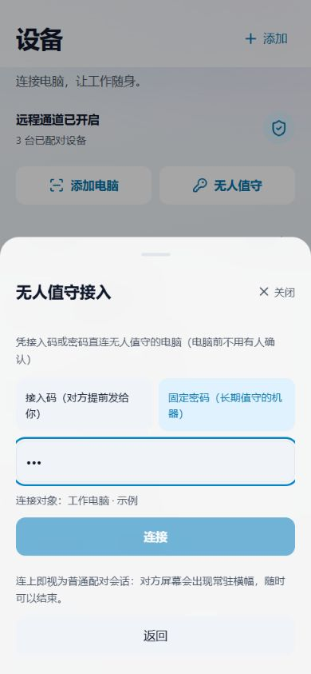

# 手机端交互检查 · 2026-10-02

本次只检查，不修改产品代码。检查范围为设备、配对、无人值守、文件、设置与远程控制。保留已确认的 C 布局、B 毛玻璃和连续动效方向。

## 方法与边界

- 读取当前组件和相关交互逻辑；在 390 × 844 浏览器视口检查使用真实 App 组件的本地预览。
- 浏览器验证：设备操作、配对出示、无人值守固定密码、文件目标选择。
- 预览使用示例数据和本地命令替身；未发起真实配对、远控或文件传输。替身拒绝操作不作为产品缺陷。
- 以下明确区分源码确认的行为、浏览器复现和设计建议。未测真机帧率、软键盘、系统返回键、摄像头权限和触摸手感。
- P1 表示优先处理的流程阻碍或误导；P2 表示明显增加理解或操作成本。没有据此给产品整体打分。

## P1：优先修复1

### 1. 控制电脑时，收到文件请求没有可达入口

**触发：** 已进入远程控制，对方此时发送文件到手机。

**源码确认：** `App.tsx:76` 隐藏整个主界面；文件请求提示、导航角标和文件页均在其内部（`:108`、`:141`、`:171`）。`RcMobileSession.tsx` 和 `SessionToolbar.tsx` 未提供文件请求处理入口。应用仍订阅请求，但当前会话界面无法呈现它。请求超时常量为 60 秒（`src/lib/rcFile.ts:18`）。

**影响：** 用户需要结束控制回到主界面才能处理，可能直接错过请求。

**建议：** 在会话层显示轻量文件请求提示，可打开接收面板；接收或拒绝后返回原画面。文件面板打开期间暂停远程输入，关闭后恢复，不结束会话。提示、倒计时、失败反馈都留在会话层。

**验收：** 控制和只看模式都能处理请求；横屏、工具栏收起、软键盘打开时仍可发现入口；未处理不自动接受。

### 2. 大文件准备阶段无法取消

**触发：** 选择较大文件或一批文件后改变主意。

**源码确认：** `useMobileFileSend.ts:28` 调用串行发送函数，返回值 `:49` 没有取消操作；`rcSendFiles.ts:82` 持续读块并通过 IPC 写入本机暂存，最后一块才提交文件任务。文件页任务列表的取消按钮控制后续任务，不能中止尚未提交的准备过程。

**影响：** 只能等待本机读取与暂存完成；多文件情况下，取消已提交的第一项也不会终止后续文件的准备。注意该阶段是本机暂存，不是向电脑传输，现有“正在上传”容易让人混淆阶段。

**建议：** 展示“准备文件 → 等电脑确认 → 传输中”三个阶段、批次进度和取消入口；取消时停止后续分块与文件并清理暂存，已经发出的任务单独给出状态。

**验收：** 首个文件、批次中间、切换标签后均可取消；取消后没有继续提交的文件；已提交任务与未提交文件区分明确。

### 3. 加载反馈出现在错误的按钮上

**触发：** 点击“只看画面”，或拒绝一个文件请求。

**源码确认：** `RcDeviceActions.tsx:74` 无论申请控制还是只看，都让“远程控制”变成“发起中”，被点的“只看画面”没有对应状态。`RcMobileFileAsks.tsx:55` 接受与拒绝共用 working ID，拒绝时“接受”变成“处理中”。

**影响：** 用户会误以为应用执行了另一项操作，文件接收尤其容易引起担忧。

**建议：** 记录具体动作，让被点击的按钮显示“正在申请观看 / 正在拒绝”，相关冲突按钮禁用；失败提示留在同一面板，保留重试入口。

**同类问题：** 解除配对发出请求后，“保留设备”仍能点击（`RcDeviceActions.tsx:62`），但只切换界面，不撤销已发出的解除请求。提交期间应禁止这个取消确认按钮，或明确呈现仍在处理的状态。

**验收：** 慢响应和失败情况下，控制、只看、接受、拒绝、解除配对各自反馈正确；不存在点击“保留”后仍悄悄解除的误导。

## P2：减少操作与理解成本

### 4. 横屏恢复画面的路径过深

**源码确认：** 横屏隐藏顶部“画面与画质”快捷入口（`RcMobileSession.tsx:172`）；“适应屏幕 / 回到指针”藏在“更多 → 画面与画质”中（`SessionToolbar.tsx:147`、`:230`、`:178`、`:192`）。工具栏收起时还需先展开“工具”。

**影响：** 放大画面后找不到目标，恢复视野要经过 3～4 次点击。

**建议：** 展开的工具栏直接提供“画面”，恢复适应屏幕与定位指针无需先经过“更多”。保持精简，不新增一排常驻大按钮。

**验收：** 横竖屏下高频视野恢复有明确入口；从已展开工具栏开始最多两次点击。

### 5. 手势指南与默认鼠标模式不一致

**源码确认：** 默认是触控板（`useSessionPointer.ts:36`），点按操作指针当前位置（`:96`、`:103`）；设置指南却写“点击电脑上的内容”（`RcSettingsView.tsx:122`），没有区分直接点击模式。会话中的模式提示已正确，不应移除。

**影响：** 用户照指南点某个画面目标，却点击了另一处，容易把正常模式差异当成触摸失灵。

**建议：** 指南分“触控板”和“直接点击”两段；首次连接给一个可关闭的短提示，并可直接练习。切换模式的说明与指南使用相同文案。

**验收：** 点按、移动、长按与双指操作分别与两种模式匹配；提示可以跳过，后续仍能找到。

### 6. 无人值守密码表单没有说明为何不能连接

**浏览器复现：** 从设备操作进入固定密码，输入测试字符 `123`，连接按钮禁用，页面没有长度提示或错误原因。密码规则实际为 6～64 个字符（`src/lib/rcUno.ts:49`），表单只用 `passOk` 计算禁用状态（`RcUnoJoinCard.tsx:50`、`:217`）。没有密码显隐入口。

**建议：** 输入框附近显示长度要求，输入后给具体提示，提供显示/隐藏密码。对目标未选择、无效凭证等禁用原因分别说明。

**另一处已确认：** 从设备详情进入接入码模式时，固定目标的设备名称没有呈现，目标说明只出现在密码模式或需要选设备的分支（`:175`）。两种凭证模式都应显示将连接的真实设备名称和类型。

**验收：** 不提交凭证也能理解缺了什么；模式切换后连接对象仍清晰。

### 7. 配对出示态有两个含义不同的“收起”

**浏览器复现：** 出示二维码后，码值旁“收起”隐藏配对码，底部“收起”关闭整个面板（`RcPairCard.tsx:182`、`:196`）。还同时有标题栏关闭与拖动关闭。

**影响：** 用户需要试点才知道会消失哪一部分。二维码展示后还要再点击“我出示这枚码（等对方来连）”进入监听，阶段说明较难理解。

**建议：** 用“隐藏配对码”明确隐私动作；面板关闭统一由标题栏和手势完成。明确区分“扫码连接电脑”与“让对方连接手机”，先说明选哪条路径，再展示该路径必要动作。是否自动进入监听需另行确认完整配对协议，不直接承诺。

**验收：** 相同按钮名称对应相同结果；出示、等待、对方确认阶段能被明确理解。

### 8. 设备识别信息没有统一到选择器

**浏览器复现：** 首页有类型图标与类型文案，文件选择器却只有设备名，而且标题“选择电脑”下包含 iPad 示例。`RcFilesView.tsx:184`、`:199`；无人值守候选同样主要是名称与指纹（`RcUnoJoinCard.tsx:190` 起）。

**影响：** 同名或多设备时仍不好辨认；首页已经解决的问题在其他入口重现。

**建议：** 文件选择器复用设备图标、真实名称、类型与连接状态，标题改“选择设备”；无人值守仅展示实际支持的目标能力，类型信息仍保留。不要仅凭操作系统武断判断是否支持控制。

**日常路径：** 设备操作面板同时提供控制、只看、文件、无人值守、解除配对五种选择。建议强化主要连接动作，将低频解除配对收入设备管理，保留确认步骤。这属于效率建议，不是已经发生误删除的证据。

**验收：** 同名电脑/手机/平板可分辨；不再出现标题和候选类型冲突。

### 9. 文件请求缺少明确倒计时，催促文案角色反了

**源码确认：** `RcMobileFileAsks.tsx:40` 已计算剩余秒数但没有展示；超过 30 秒只显示“对方可能没看到，请求快超时了”（`:48`）。这是对方发给本机、等待本机接受的请求，不是等待对方响应。

**建议：** 显示“等待你确认 · 还剩 xx 秒”，快到期时增强文字提醒；已过期移除可操作入口并解释需要对方重新发送。

**验收：** 倒计时与后端一致；前后台切换重新核对时间；零秒后不能误以为仍能接受。

## 建议实施顺序

1. 文件请求会话入口、准备阶段取消、准确的动作反馈。先让流程完整、可中止、不会误解。
2. 横屏快捷操作、模式指南、表单校验。降低控制与连接学习成本。
3. 配对入口说明、选择器统一、请求倒计时。保持手机和桌面现有语义一致。

本轮不再增加装饰动画。新增提醒与面板沿用现有 B 动效；真实触摸、系统权限和键盘遮挡需在 Android 真机另测。

## 未当作问题报告的已实现行为

- 文件页只有一台配对设备时已自动选中（`RcFilesView.tsx:64`），不重复建议“单设备自动选择”。
- 文件页已访问后保留挂载，切页不直接卸载准备过程；选中目标也有应用级状态。
- 多数按钮已有 44～48px 最小触控高度；没有测量依据不概括为“所有按钮太小”。
- 弹层有关闭、拖动和返回处理；本轮未发现足够证据断言真机滚动或系统返回失效。
- 解除配对与清空记录已有确认，不能说成“一点就删”。
