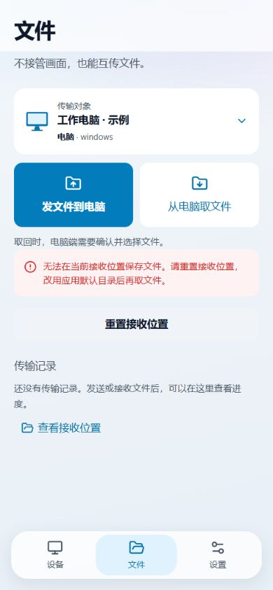

# 手机端滑动页签与取文件提示 · 2026-10-02

用户确认 `design/手机端-滑动页签与取文件提示-2026-10-02.html` 后实施。保留 C 布局、B 毛玻璃、现有页签顺序与文件页常驻状态。没有升级版本、提交 Git、打包 APK 或 exe。

## 左右滑动切页

- 左滑：设备 → 文件 → 设置；右滑返回上一页。首末页不循环，底部点击保留。
- 12px 后判定横向意图；慢滑达到 60px 或快速滑过 32px 才切换，短拖动回位。页面跟手位移最多 64px，边界增加阻力；不是三个页面同时全幅拖动的 pager。
- 复用现有弹簧与页签进场动效；减少动态效果时不移动页面，仍保留切换反馈。失焦、后台、取消、多指、捕获丢失时中止，空闲没有持续帧循环。
- 输入框、滑块、编辑区域、选中文本、系统左右 24px 边缘、弹层及远控会话不触发切页。滑过可点击设备时阻止尾随点击，真正点按不受影响。
- 仍通过 App 的统一页签选择函数保存/恢复滚动位置；文件准备不因切页卸载。

## “从电脑取文件”的权限报错

原提示把含 `permission / denied` 的错误统一翻译为“操作权限不足，请检查系统设置”，没有说明手机、电脑或应用哪一侧失败。本次：

1. 共享 `permissionErrorInfo` 区分应用内部授权、接收目录、文件读取、相机与未知拒绝；手机错误提示、文件任务分类及桌面未捕获错误都调用同一判断，避免磁盘拒绝被误报为对方拒绝。
2. 取回失败在按钮附近说明具体处理：目录失败可“重置接收位置”；内部授权失败提示重新打开后重试，不要求修改手机权限；明确电脑拒绝时指向电脑端确认并选择文件。电脑拒绝的终态任务也有恢复说明。
3. 重置期间禁用重复提交，只有成功后清除原错误；失败保留可见错误。新取回使用重置返回的目录，发送新请求时清掉过期的“请重新取文件”提示。
4. 文件页与会话接收面板共用 `useMobileReceiveDir`。重新显示时读取生效目录，隐藏时可缓存在途结果，卸载后不写状态；序号防止旧结果覆盖新路径。没有目录轮询。
5. 扫码提示也沿用分类：相机拒绝有明确设置路径与重试/手动输入出口；无摄像头或无法打开摄像头不会被误报成权限不足。

### Android 目录修复

旧代码从存储根目录与包名手工拼接应用外部目录，再在第一次取回时创建。Android 11 起，应用专属外部目录应由系统提供，不能自行创建这一级目录。[Android 官方存储说明](https://developer.android.com/about/versions/11/privacy/storage#app-specific-directory-external)

现在在 setup 使用 Tauri 的 Android 路径解析器取得应用下载目录（本地 SDK 代码调用 `getExternalFilesDir(DIRECTORY_DOWNLOADS)`），缓存给唯一的 `default_receive_dir` 取值口。命令、自动接收和目录重置仍走同一个入口。解析失败明确报错，不猜 `/storage/emulated/0` 或包名；重置先创建接收子目录，成功后才保存配置。

这修正了一处已确认的代码问题；尚未取得用户原始错误日志，不能据此断言它是此次报错的唯一原因。新默认路径不会迁移或删除已有接收文件，旧任务路径保留。

## 验证

- 全手机端与共享权限/文件分类回归：31 个文件、186 项通过。
- 随后补充快速短甩守卫及最终目录反馈调整，相关 3 个文件、21 项通过；新增 1 项，当前合计 187 项。
- Rust 文件传输 4 项通过；包含 Android 路径单一来源守卫。这是桌面测试，不能代替 Android 系统路径运行验证。
- TypeScript、最终手机前端构建、带 React Hooks 规则的本次源文件 ESLint 通过；UI 显式检查无 block，5 个组件 / 55 个 CSS module 引用有效；diff 空白检查通过。
- 真实 App 组件的隔离浏览器示例验证了目录错误 → 重置 → 成功反馈 → 再次请求。示例不触碰真实目录、设置、摄像头或远程电脑。触摸滑动用自动化 PointerEvent 测试验证，浏览器鼠标操作不当作真机触摸验证。
- 按本机 code-review 命令复核权限分类优先级、配置保存时机、请求竞态、手势取消与错误可见性。没有放宽 Android 或 Tauri 权限，没有修改信任门或自动接受策略。
- 构建保留已有 rcStore 动态/静态导入提示；测试保留 Canvas 环境提示，检查结果通过。

## 真机待验

需要新版 APK 验证 Android 系统提供的目录、真实电脑取回、多指与边缘返回、列表滚动和弹层同时使用。当前已安装 APK 不含这些改动；本次未打包或安装。

设计确认稿：`design/手机端-滑动页签与取文件提示-2026-10-02.html`。

真实组件示例：`design/手机端-滑动页签与取文件落地预览-2026-10-02.html`（刷新重置示例失败状态）。

